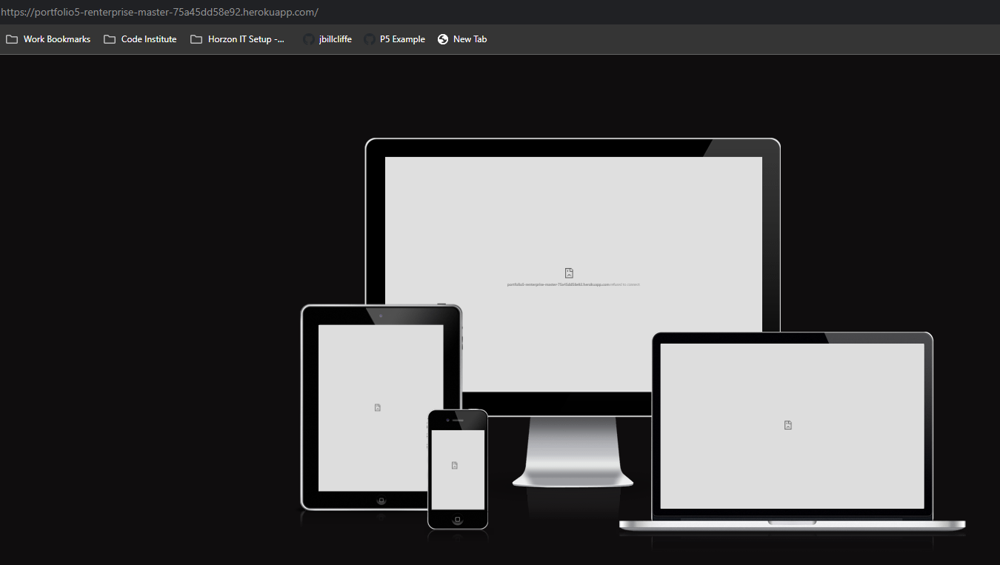
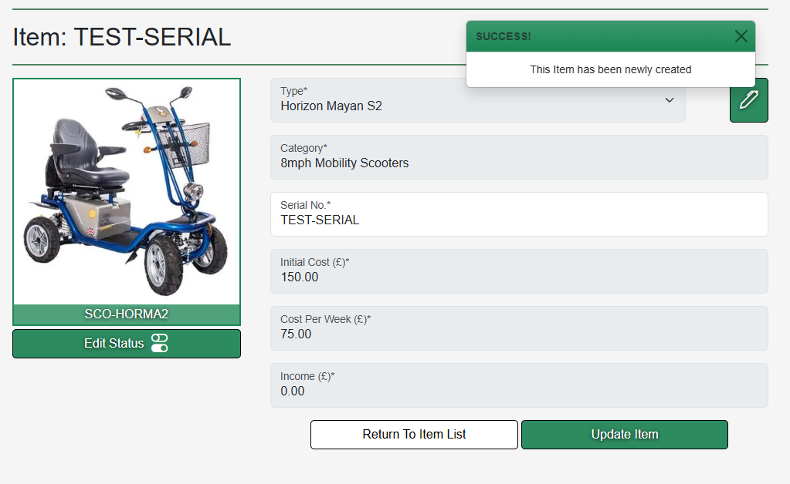
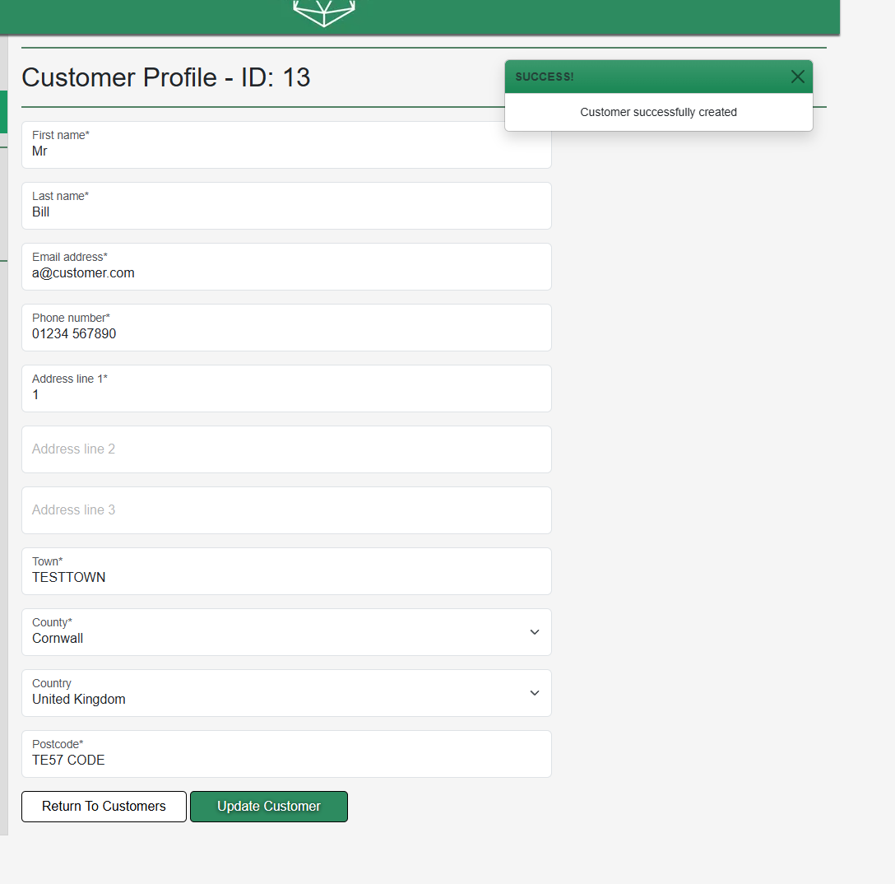
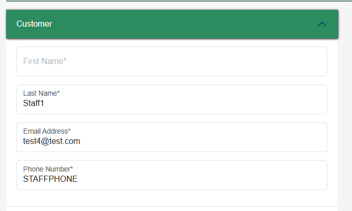

# Renterprise - The "Final" Program

***Click this banner to load the website.***

A final prototype for a rental booking system. 
To create orders for customers and provide them with hired equipment. This example is based on a company hiring mobility equipment. However, the stock is based on what your provide to it. Flexibility is key to this software.
This e-commerce site is advertising itself as software to be sold onto another business B2B. But the actual implementation of the software is B2C. Allowing the purchasing business to take payments from their customers.

More people are turning to rentals as the world finances are in disarray and they can have your product at a much more manageable  cost. 

This interface is developed using designs and features from [Portfolio 1](https://github.com/jbillcliffe/portfolio1-renterprise/ "Go to Portfolio 1 - Renterprise Website")[XX] and [Portfolio 3](https://github.com/jbillcliffe/portfolio3-booking-system/ "Go to Portfolio 3 - Renterprise Python Console Booking System")[XX] and [Portfolio 4](https://portfolio4-django-renterprise-00869e0146b8.herokuapp.com/ "Go to Portfolio 4 - Renterprise - The Program")[XX]

**This software will improve your hire bookings right from the start!**

# User Experience Design

## Target Audience
- Current business owners ready to make a change to their software.
- A consumer who is ready to take on a new challenge.

## User Stories
User stories and model structures created in [GitHub Projects](https://github.com/users/jbillcliffe/projects/7/views/1 "View GitHub Projects") [XX]

## Wireframe Program Flow
Program flow wireframe was created using Figma[XX]. The image shows the processes through the stages of the software.
Some parts are still in development. New data structure implemented compared to Portfolio 4. Although this wireframe is from the previous project.[XX].

## Logo - Redocumented from Portfolio 1.
The logo was created using the website LOGO.com[XX]. It has been pulled from my previous Renterprise project for Portfolio 1[XX].

### Logo Process - Redocumented from Portfolio 1[XX].
Using their step by step builder a full brand could be created from scratch, firstly the selection of software industry was chosen as it was accurate and appropriate.

Next, it gave an overall palette choice, blues, greens etc. Given the fact that a product is trying to be sold, and green symbolises wealth it seemed like a logical decision.

The creator then asked for a styling of the font to be used, a modern font was the best choice as it is for a modern product.

The final font choice for the logo was then made and it displayed the generated logo with it.

This was then the branding provided.

## Responsive

Attempts were made to use a responsive tester from previous projects. However, due to every page requiring security clearance the page would not load.

## Breakdown of Design - Redocumented from Portfolio 1[XX].

### Colour Theme
Colour theme was initially chosen and subsequently revised with Coolors.[XX] 
The overall palette was picked with the website tools which enabled complementary and contrasting colour choices based upon the initial colour from the logo.

# Features

## Existing Features

**Accounts Log In / Log Out / Sign Up**

A user can enter the website and sign up using a quick and simple form. Although it merely grants them a customer level account at first.

[Sign Up Validation](readme/accounts/sign-up-validation.png "Social media links footer")

The user would then be requested to confirm their email address:

Which will lead to the receiving of an email. (without paying for a domain this was the only possible functioning result):

Following the link inside will lead back to the website for the user to click on the button to confirm this.

Which, when you look at the admin panel - Sets up the user like this :

The user can have their role set in the admin panel (ideal implementation would be on the program front end too):

After all is done a user can log out and be returned to the home screen with no login credentials.

**Detailed Home Page**

The display will vary depending upon the user.

An anonymous user, will have no sidebar, thereby forbidding access to the core of the software.

Also to an anonymous user they will be shown an enquiry form, using mailchimp to capture an email address.

When a user is logged in, it will grant them different levels of access.
At this stage. A customer (defined in this instance as a customer of the software, not a customer of the software seller),
cannot view much at all on the home page. But they would be able to view their customer profile and to see orders (in the future).

Featured is a sidebar with virtually no access to anything.

Once logged in, much more access is granted:

Available to all users (including anonymous):
A [footer](readme/homepage/home-footer.png "Social media links footer") - With a "[Facebook](readme/homepage/home-facebook-link.png "Example of dummy facebook page in a modal window")" page link, a sofware features carousel, this improves the SEO of the software itself with strong use of alt-tags in a concentrated space.

**Create Item**

Creating an item can be divided into two categories. The Item Type (stock option) and an Item (the owned stock option with a serial number)

***Add New Item Type***

A form that asks for the critical data for a type. It will also generate a suggested SKU based on name and category. Then adding a random number to keep it unique.
The client side validation is based upon the category selection. Which will allow you to either select from a category previously used, or to create a new one. Thus giving the business as many choices as they would like.
A category to assign it to (categories used previously will mean that it can be joined together later on). Validation occurs on all the visible fields marked with an *. It also uses Cloudinary[XX] to [allow images to be stored externally](readme/item_type/item-type-form-selected-file.png "Image display after successfully selecting file") and accessed remotely. These images are useful to provide continuity across items. When complete a the user is taken to the [newly created item type view.](readme/item_type/item-type-form-submit-to-view.png "Successful item type add goes to view")
item-type-form-file-select

***Add New Item***

A form that asks for very little data, this is useful to allow quick adding of items to stock and with as few margins for error as possible.
This security is further enhanced by form validation. A category to assign it to (categories used previously will mean that it can be joined together later on). Validation is forced fairly strongly as two of the fields are restricted to choices and these choices vary depnding on what has been selected.

Item Form - Category Select

Item Form Type Select - This then displays the stored image

Item Form Complete - Entered Serial Number

Item Form Submit Success - Goes to View of the Item and displays message

---

**Create Customer**

An easy to understand [form](readme/customer/customer-create-validation.png "Overall view of the customer create form with a validation example"). It has required fields which implement validation where necessary and prompt the user to fill more information when required.
Also features a drop down menu of counties across the UK supplied by django-localflavor[XX] python/django library. When complete a success message is sent to the user and the view is transferred to the customer view :

---

**Create Order**
Uses a Bootstrap5 accordion setup to break the data into chunks. It is custom and complex behind the scenes. But what you see is a much more streamlined experience.
If you access the "Create Order" from a customer page, it prefills all the available customer data (such as the address).
Then final stage opens a Stripe Hosted Payments Page (Hosted Payments Page is more secure for holding card data of customers for subsequent transactions for hire.)

---

**List Displays**

---

***Customers***

***Orders***

***Items***

***Item Types***

***Staff***

# Testing
---

## Linting
---

Given the framework involved. Using a standard linter was not strictly the best option. I did manage to install a a django specific linter called djLint which worked within the IDE, this was also combined with Flake8 and it also worked with the html templates too. No python files have any poorly formated areas of code. 
Except for in renterprise.settings where :
- Some setting strings are too long, but cannot be broken up and this would render them unusable.
- In the templates. Intially, I had some inline styles, now wherever possile they are part of the css style sheet.
- No errors arrive through the linter/template analysis.
- Migration files also appear. Which are also negligible here.

## Manual Testing
---

This section is broken down into the different areas of the program and to how it is expected to function.

### Main Menu
---

- [x] Log out?     
- [x] Force log in?  
- [x] Register?            
- [x] Functioning nav buttons?
- [x] Header logo back to home?
- [x] Social Media links? (One dummy one to load FB modal, others load the social media home page)

### Admin
---

- [x]  Able to edit existing entries?         
- [x]  Can only access as a user?              
- [x]  Force login if trying to access via url?   

### Create Customer
---

- [x]  Create customer fields valid where needs to be?           
- [x]  Validate clearly states where to edit?             
- [x]  Feedback on submission?                   
- [x]  Navigate to created customer on submission?        
- [x]  Drop down for counties for future filtering?                          
- [x]  Return to customer list button?  

### View Customer
---

- [x]  All fields clearly visible?
- [x]  Seperation of data to maximise use of space
- [x]  Side bar shows correct options? 
        1. [x] Back to customer list 
        2. [x] Display Name 
        3. [x] Customer Notes 
        4. [x] Customer Orders 
        5. [x] New Order 
- [ ]  Status buttons restrictons if archived/deceased?
- [ ]  Status button updates customer?
These are wants for the future. But would not affect the core usability of the program

### Customer List
---

- [x]  Pagination?
- [x]  List has clickable element to go to customer?
- [ ]  Hide archived customers?
- [ ]  Show customers who are deceased clearly?
Customers cannot be hidden at this time, so this cannot be tested 

### Create Order
---

- [x]  Form presented in stages?
- [x]  Collection after delivery?
- [x]  Item has to be selected before moving forward to price?
- [x]  Default pricing inserted when item selected (can be changed)?
- [x]  Hide create order button until all is valid? (not hidden, but validation stops it acting)
- [x]  Only show valid orderable items for time period?
- [x]  Paginate items if necessary? (Not required. This was changed to an auto stock assigner!)
- [x]  Create first invoice on submission?
- [x]  Navigate to order view when submitted successfully.

### View Order
---

- [x]  Display all data clearly?
- [x]  Display item image?
- [x]  Sidebar correct? 
        1. [x] Home 
        2. [x] Customer List (back to) 
        3. [x] Display name 
        4. [x] Display order number 
        5. [x] Order Notes (active when on list screen) 
        6. [x] Customer orders (to order list) 
- [x]  Invoice window shows all invoices?
- [x]  Paginate invoices?
- [x]  View/Edit invoices? (They can be paid or unpaid. Greater flexibility in future works.)

### Items List 
---

- [x] Show list of items?
- [x] Paginate list of items?
- [x] Clearly show status of items?
- [x] Sidebar correct? 
        1. [x] Home 
        2. [x] Item List (active when on list) 
        3. [x] New Item (active when creating item) 
        4. [x] New Item Type (active when creating item type) 
- [x] Can click an item to view it?

### Item View
---

- [x] Show data clearly?
- [x] Show item image?
- [x] Return to item list button?
- [x] Sidebar correct? 
        1. [x] Home 
        2. [x] Item List (active when on list) 
        3. [x] Current status display  (on image)
        4. [x] Edit status buttons, do not show button for current status  (under image)
- [x] Status buttons pop up modal to confirm. (changed to switches in a modal to be selected)
- [x] Status change reloads window, showing new status

### New Item
---

- [x] Validate form fields?
- [x] Clearly display where data is required?
- [x] On save go to item view of the item made?

### New Item Type
---

- [x]  Validate fields?
- [x]  Allow empty image (will save as placeholder)?
- [x]  Clearly show where data required
- [x]  Return to items list on save
- []  Show previous categories 
This would be in a future release

# Deployment

To deploy this project:

- Fork and clone this repository to your local machine.
- Create a new Heroku app.
- In the Heroku dashboard, navigate to the app's settings and set the buildpacks to Python and NodeJS in that order.
- Connect your Heroku app to the repository by linking it to your forked copy of the repository.
- Click on the "Deploy" button in the Heroku dashboard.
- After following these steps, the app is successfully deployed to Heroku.

- NB. You would need your own Credentials from Google to operate your own google spreadsheets. Also a creds.json file would need to be implemented into your own code and added to the .gitignore.
- This creds file would then be copied and pasted into a VALUE in the Heroku App Settings.

[LIVE RENTERPRISE SOFTWARE](https://portfolio5-renterprise-master-75a45dd58e92.herokuapp.com/ "Go to Renterprise")

# Technologies Used

## Languages

- HTML5
- CSS3
- Python 3
- Django Templates
- Javascript/jQuery
- XML

# Bugs
- Documented in here : [Bugs Files](readme/bugs/ "Link to the bugzone")

## Relevant Help Links
1. Back to customers etc.
https://stackoverflow.com/questions/524992/how-to-implement-a-back-link-on-django-templates

2. How to toggle class
//https://www.w3schools.com/howto/howto_js_toggle_class.asp

3. get_context help :
https://stackoverflow.com/questions/37370534/django-listview-where-can-i-declare-variables-that-i-want-to-have-on-template

5. Bootstrap kept overriding button style when it is unwanted.
Have to use javascript to submit the form and keep FloatingField styles
- A request to crispy forms to remove default bootstrap styling on form buttons.
- It was not ideal to work around. However, it was by creating the button in raw HTML
(customers/forms.py) lines 50/51
https://github.com/django-crispy-forms/django-crispy-forms/issues/158

6. Adding pagination to a non-class ListView
https://www.geeksforgeeks.org/how-to-add-pagination-in-django-project/

7. def invoice_create 
**Bug zone** wsgirequest' object has no attribute 'amount_paid' 
Change to same type as status change, to implement as posting form
is causing problems. So values will be sent by URL.
the form created by JS. JS dynamically validates the fields
prior to submission. 
<b>Main fix was in the end dynamically and manipulating javascript to create the form for the modal window and functions associated with it.</b>

8. Best practice for django constants :
https://stackoverflow.com/questions/12822847/best-practice-for-python-django-constants

## Frameworks, Libraries & Programs Used

- Font Awesome[^5]
- Gitpod[^14]
- Figma[^1]
- Heroku[^7]
- Django Frameworks[^13]

# Technologies Used

## Python Libraries :
**Sourced from PyPI**[^8]
[^101]: django-localflavor is a package that offers additional functionality for particular countries or cultures : https://pypi.org/project/django-localflavor/
[^102]: django-crispy-forms is a package that allows greater form manipulation and quick template tag insertion :
https://django-crispy-forms.readthedocs.io/en/latest/
[^103]: django-summernote is a "WYSIWYG" text editor. Allows for rich text field entries.:
https://pypi.org/project/django-summernote/
[^104]: djlint a django template formatting analyser: https://open-vsx.org/extension/monosans/djlint
[^105]: Flake8 : https://marketplace.visualstudio.com/items?itemName=ms-python.flake8
bleach - an HTML sanitising library
cloudinary - an image hosting service to allow uploads and downloads
dj3-cloudinary-storage - part of the above package for hosting images
crispy-bootstrap5 - a bootstrap 5 styling for django-crispy-forms
gunicorn- Gunicorn is a Python WSGI HTTP Server for UNIX
psycopg2 - Implementation of a PostgreSQL adapter for Python
pylint-django - a python linter that incorporates django frameworks structure.
whitenoise - implified static file serving for Python web apps

*NB. There are other libraries but they were installed as part of others.

## Website Tutorials/References
- W3Schools[^10]
- Stack Overflow[^11]
- Pycode[^12]

# References 
[^1]: Figma is a free website for designing storyboards and wireframes : https://www.figma.com/
[^2]: LOGO website used for creating a logo and branding from scratch for free : https://app.logo.com/
[^3]: Coolors website for creating free colour themes : https://www.coolors.com/
[^4]: Renterprise Portfolio 1 - My own web design I created as part of my first project for Code Institute. This software is an extension of the idea of Renterprise: https://github.com/jbillcliffe/portfolio1-renterprise/
[^5]: Renterprise Portfolio 3 - My own python console program created as part of my third project for Code Institute. This software is an extension of the idea of Renterprise: https://github.com/jbillcliffe/portfolio3-booking-system/
[^6]: GitHub projects - A way of creating workflows for a project and being able to manage across teams.: https://github.com/users/jbillcliffe/projects/4
[^7]: Heroku - A place to host projects. In this case to host the python terminal. : https://www.heroku.com
[^8]: PyPI - the package index. Containg a whole wealth of python libraries to plug in: https://pypi.org/
[^10]: W3Schools- Invaluable for providing details on elements and their attributes and so much HTML/CSS information : https://www.w3schools.com/
[^11]: Stack Overflow - One of the most important resources for developers : https://stackoverflow.com/
[^12]: How to do correct formatting for PEP8 : https://peps.python.org/pep-0008/
[^13]: Django Frameworks. The framework that allows the operation of this as an MVC model : https://www.djangoproject.com/
[^14]: Gitpod, a cloud based IDE for developing the web application : https://www.gitpod.io
[^15]: Font Awesome - A great source of free icons to use in many formats : https://www.fontawesome.com
